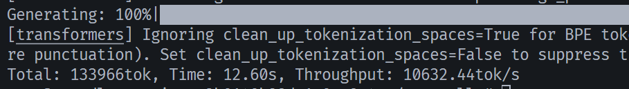
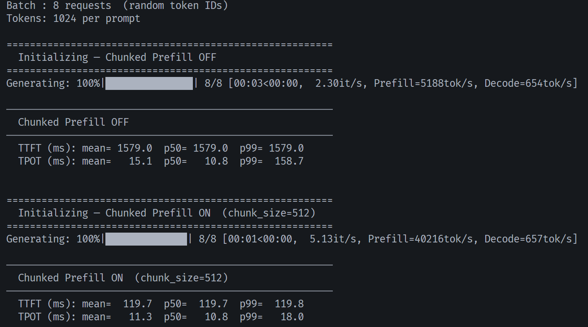
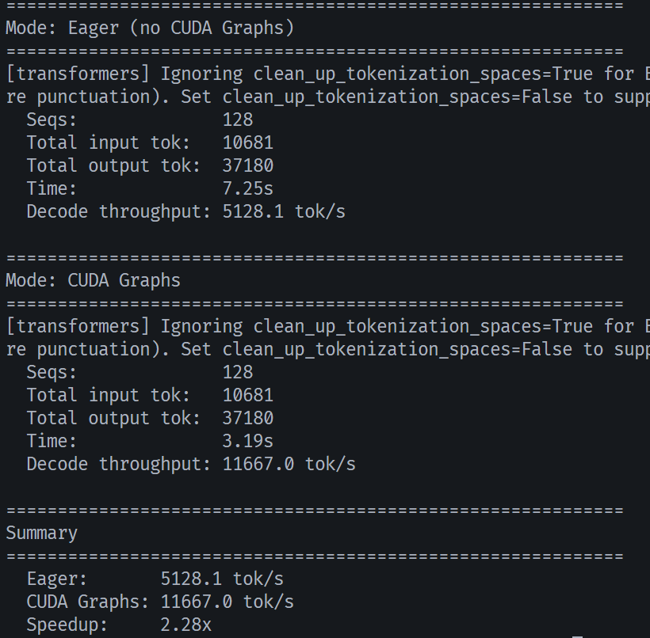
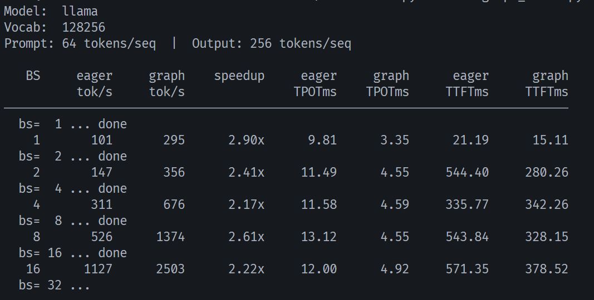

<p align="center">

</p>

<p align="center">
<a href="https://trendshift.io/repositories/15323" target="_blank"></a>
</p>

# Nano-vLLM

> 轻量级 LLM 推理引擎，专注于可读性与教学。

基于 [Nano-vLLM](https://github.com/GeeeekExplorer/nano-vllm) 补充：

- **Llama 模型支持** — 完整实现 LlamaForCausalLM，兼容 HuggingFace safetensors 权重
- **Chunked Prefill** — prefill 与 decode 混合调度，降低长 prompt 下的首 token 延迟
- **Benchmark 套件** — chunked prefill 对比、CUDA Graphs 吞吐对比

---

## 使用

### 测试脚本

#### 1. Chunked Prefill 对比 — `chunk_bench.py`

测试 chunked prefill 开关对首 token 延迟（TTFT）和 token 间延迟（TPOT）的影响。使用 8 条等长随机 prompt 分别跑 eaget 模式和 chunked prefill 模式，打印延迟分布。

| 参数                   | 值   | 说明                                |
| ---------------------- | ---- | ----------------------------------- |
| `num_prompts`        | 8    | 并发请求数                          |
| `prompt_len`         | 1024 | 每条 prompt 的 token 数             |
| `max_tokens`         | 128  | 每条最大生成 token 数               |
| `temperature`        | 0.6  | 采样温度                            |
| `prefill_chunk_size` | 512  | chunked prefill 每步处理的 token 数 |

```bash
# Qwen3-0.6B（默认）
python chunk_bench.py

# 其他模型
python chunk_bench.py --model_path ./Llama-3.2-1B-Instruct/
```

输出示例：

```
Batch : 8 requests  (random token IDs)
Tokens: 1024 per prompt

========================================================
  Initializing — Chunked Prefill OFF
========================================================
Generating: 100%|███████████████| 8/8 [00:03<00:00,  2.30it/s, Prefill=5188tok/s, Decode=654tok/s]

────────────────────────────────────────────────────────
  Chunked Prefill OFF
────────────────────────────────────────────────────────
  TTFT (ms): mean= 1579.0  p50= 1579.0  p99= 1579.0
  TPOT (ms): mean=   15.1  p50=   10.8  p99=  158.7


========================================================
  Initializing — Chunked Prefill ON  (chunk_size=512)
========================================================
Generating: 100%|██████████████| 8/8 [00:01<00:00,  5.13it/s, Prefill=40216tok/s, Decode=657tok/s]

────────────────────────────────────────────────────────
  Chunked Prefill ON  (chunk_size=512)
────────────────────────────────────────────────────────
  TTFT (ms): mean=  119.7  p50=  119.7  p99=  119.8
  TPOT (ms): mean=   11.3  p50=   10.8  p99=   18.0
```

**解读**：chunked prefill 打开后，TTFT 显著降低（长 prompt 不再阻塞 decode），TPOT 基本不变。

#### 2. CUDA Graphs vs Eager — `cudagraph_bench.py`

批量大小扫描测试。CUDA Graphs 通过消除 kernel launch overhead 加速 decode，overhead 占比越高的场景加速越明显。脚本在 8 个批量大小（1 ~ 128）下分别跑 eager 和 graph 模式，对比吞吐和延迟。

| 参数            | 值                             | 说明                             |
| --------------- | ------------------------------ | -------------------------------- |
| `BATCH_SIZES` | `[1, 2, 4, 8, 16, 32, 64, 128]` | 扫描的批量大小                   |
| `PROMPT_LEN`  | 64                             | 每条 prompt 的 token 数（短）    |
| `OUTPUT_LEN`  | 256                            | 每条最大生成 token 数            |
| `temperature` | 0.6                            | 采样温度                         |
| `ignore_eos`  | True                           | 忽略 EOS，确保每条生成足量 token |

```bash
python cudagraph_bench.py --model_path ./Llama-3.2-1B-Instruct/
```

输出示例：

```
Model:  llama
Vocab:  128256
Prompt: 64 tokens/seq  |  Output: 256 tokens/seq

   BS     eager     graph    speedup     eager     graph      eager      graph
          tok/s     tok/s               TPOTms    TPOTms     TTFTms     TTFTms
──────────────────────────────────────────────────────────────────────────────
  bs=  1 ... done
    1       101       295      2.90x      9.81      3.35      21.19      15.11
  bs=  2 ... done
    2       147       356      2.41x     11.49      4.55     544.40     280.26
  bs=  4 ... done
    4       311       676      2.17x     11.58      4.59     335.77     342.26
  bs=  8 ... done
    8       526      1374      2.61x     13.12      4.55     543.84     328.15
  bs= 16 ... done
   16      1127      2503      2.22x     12.00      4.92     571.35     378.52
  bs= 32 ... 
```

**解读**：批量越小，CUDA Graphs 加速越明显（bs=1 时 speedup 可达 2.9x），因为 kernel launch overhead 在总耗时中占比最大。批量增大后计算成为瓶颈，加速效果递减。

---

## 结果

> 测试环境：**RTX 4090** · PyTorch 2.5.1 · CUDA 12.4

### 1. Llama 模型推理




### 2. Chunked Prefill 延迟对比



### 3. CUDA Graphs  vs Eager




